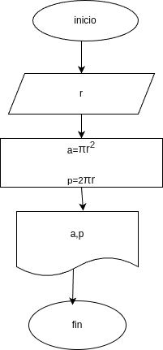

# Programa 1: area_perimetro_circulo
programa en python para calcular en area y el perimetro de un circulo, dado el valor de su radio

## Análisis

### Valiables de entrada 
- r: radio del circulo

### Rrocesamiento
- a: area del circulo
- p: perimetro del circulo 

$a = \pi*r^2$
$p = 2*\pi*r$

## Diseño

## Construccion
